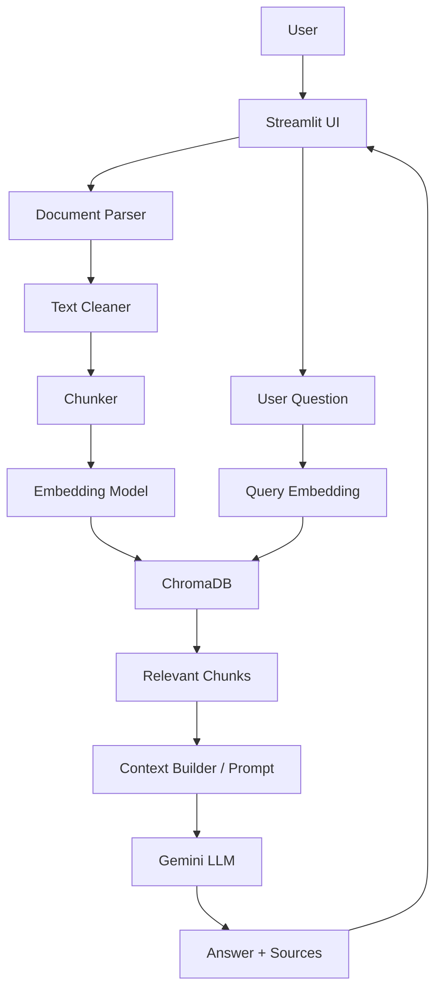

# RAG Chatbot

A document-grounded RAG (Retrieval-Augmented Generation) chatbot built with
Python, Streamlit, ChromaDB, local embeddings, and Google Gemini.

## Table of Contents

- [Overview](#overview)
- [Features](#features)
- [Architecture](#architecture)
- [Tech Stack](#tech-stack)
- [Project Structure](#project-structure)
- [Installation](#installation)
- [Environment Variables](#environment-variables)
- [Running the Application](#running-the-application)
- [How RAG Works](#how-rag-works)
- [Example Usage](#example-usage)
- [Testing](#testing)
- [Future Improvements](#future-improvements)

## Overview

Attach PDF, DOCX, TXT, or Markdown documents right from the chat box (the
📎 icon, same as ChatGPT/Gemini) and ask questions about them. The
assistant answers **only from the content of your uploaded documents** —
it retrieves the most relevant chunks, sends just that context to Gemini,
and cites the source file (and page, when available) for every answer.
If nothing relevant is found, it says so instead of guessing.

Conversations are saved to disk and listed in the sidebar, so you can pick
up an earlier conversation later — even after restarting the app.

## Features

**Document handling**
- Multi-document upload directly from the chat input's attach icon
  (PDF, DOCX, TXT, Markdown) — ChatGPT/Gemini-style, no separate uploader
- Robust text extraction with graceful handling of empty/corrupted files
- Text cleaning (whitespace, broken line breaks, extraction artifacts)
- Structure-aware chunking (paragraph/sentence-boundary-first splitting)
- Duplicate-upload protection (same document isn't re-indexed twice)

**Retrieval & answers**
- Local embeddings (`sentence-transformers`, no external embedding API)
- Persistent ChromaDB vector store (no re-indexing after a restart)
- Semantic retrieval with a configurable similarity threshold
- Gemini-powered, context-grounded answer generation
- Source citations (filename + page number when available)
- Strict document mode (on by default) — refuses to guess beyond the docs
- Small talk — greetings, self-introductions ("hi, my name is..."), and
  conversational-recall questions ("what's my name?", "what did I say?")
  always get a normal reply, even in strict mode. Strict mode only guards
  *document* facts, not the conversation itself
- Retrieval transparency / debug mode (see the retrieved chunks + scores)

**Conversation**
- Conversational chat with history — remembers earlier turns for
  continuity (e.g. your name, follow-up references) alongside document
  grounding
- Persistent conversation history, ChatGPT-style — every conversation is
  saved to disk, listed in the sidebar with an auto-generated title, and
  can be reopened later (including after a restart)
- New chat, delete conversation, clear document index

**Reliability**
- Friendly error handling throughout — no raw stack traces in the UI

## Architecture



Conversations are a separate concern from the RAG flow above: each chat
session is saved as its own JSON file (see [`conversation_service.py`](app/services/conversation_service.py))
and reloaded into the UI when you pick it from the sidebar.

## Tech Stack

| Concern | Choice |
|---|---|
| Language | Python 3.11+ |
| UI | Streamlit |
| Document parsing | `pypdf`, `python-docx`, built-in text/Markdown handling |
| Chunking | LangChain's `RecursiveCharacterTextSplitter` |
| Embeddings | `sentence-transformers/all-MiniLM-L6-v2` (configurable) |
| Vector store | ChromaDB (persistent, local) |
| LLM | Google Gemini (`google-genai`) |
| Conversation storage | Plain JSON files on disk |
| Config | `.env` via `python-dotenv` |

## Project Structure

```
app/
├── main.py                     # Streamlit entry point / orchestration
├── config/
│   └── settings.py             # Env-driven configuration
├── ui/
│   ├── sidebar.py               # Conversation history, document list, and settings UI
│   ├── chat.py                  # Chat input (incl. file attach), sources, debug view
│   └── components.py            # Small reusable UI pieces
├── rag/
│   ├── document_loader.py       # PDF/DOCX/TXT/MD -> DocumentPage
│   ├── text_cleaner.py          # Whitespace/artifact cleanup
│   ├── chunker.py                # Text -> Chunk (with metadata)
│   ├── embeddings.py             # Cached sentence-transformers wrapper
│   ├── vector_store.py           # Persistent ChromaDB wrapper
│   ├── retriever.py              # Question -> relevant chunks
│   ├── prompt.py                 # RAG prompt template
│   ├── generator.py              # Gemini answer generation
│   └── small_talk.py             # Greeting/intro/recall detection
└── services/
    ├── document_service.py      # Parse+clean orchestration, per-file errors
    ├── rag_service.py           # Full pipeline: index + ask
    └── conversation_service.py  # Save/load/list/delete past conversations
data/
├── uploads/                     # Uploaded documents (gitignored)
├── chroma/                      # Persistent vector store (gitignored)
└── conversations/                # Saved chat history, one JSON per conversation (gitignored)
tests/                            # Unit & integration tests (one file per module above)
```

## Installation

### 1. Create a virtual environment

```bash
python -m venv .venv
```

**Activate it:**

macOS/Linux:

```bash
source .venv/bin/activate
```

Windows:

```bash
.venv\Scripts\activate
```

### 2. Install dependencies

```bash
pip install -r requirements.txt
```

> **Note (Intel macOS):** PyTorch stopped publishing x86_64 macOS wheels
> after 2.2.2. `requirements.txt` pins `torch==2.2.2` plus compatible
> `numpy`/`transformers`/`sentence-transformers` versions for that
> platform. On other platforms these pins still work but you may use
> newer versions if you prefer.

### 3. Configure environment variables

```bash
cp .env.example .env
```

Edit `.env` and set `GEMINI_API_KEY` (get one at
[Google AI Studio](https://aistudio.google.com/app/apikey)). Never commit
your real `.env` file — it's already excluded via `.gitignore`.

> **Free tier note:** Google's free tier caps requests per day per project
> for a given model (check current limits in AI Studio). If you hit a
> `429`/quota error while testing, the app shows a friendly "unable to
> generate an answer" message rather than crashing — just wait for the
> quota to reset or use a paid key.

## Environment Variables

See [`.env.example`](.env.example) for the full file with defaults:

| Variable | Purpose | Default |
|---|---|---|
| `GEMINI_API_KEY` | Your Gemini API key (required for answers) | _(none — required)_ |
| `GEMINI_MODEL` | Gemini model name | `gemini-3.5-flash-lite` |
| `GEMINI_TEMPERATURE` | Sampling temperature (0.0-2.0); lower = more literal/consistent | `0.2` |
| `EMBEDDING_MODEL` | sentence-transformers model name | `sentence-transformers/all-MiniLM-L6-v2` |
| `CHROMA_PERSIST_DIR` | Where the vector store is saved | `data/chroma` |
| `CHROMA_COLLECTION_NAME` | ChromaDB collection name | `rag_documents` |
| `CHUNK_SIZE` | Characters per chunk | `800` |
| `CHUNK_OVERLAP` | Character overlap between chunks | `150` |
| `TOP_K` | Number of chunks retrieved per question | `5` |
| `SIMILARITY_THRESHOLD` | Minimum cosine similarity ([-1, 1]) for a chunk to count as relevant | `0.2` |
| `STRICT_DOCUMENT_MODE` | Refuse to answer beyond the documents | `true` |

## Running the Application

```bash
streamlit run app/main.py
```

Opens at `http://localhost:8501`.

1. Click the 📎 attach icon in the chat box, pick a document, and send —
   you'll see a "📄 Indexed N chunk(s)..." confirmation in the reply.
2. Ask questions in the same chat box (with or without an attachment).
3. Use **New chat** to start a fresh conversation, or click any past
   conversation in the sidebar to reopen it.
4. Open **⚙️ Advanced settings** to toggle strict document mode or the
   retrieval debug view.

## How RAG Works

1. **Upload** — you attach PDF/DOCX/TXT/MD files via the chat input's
   📎 icon.
2. **Parse** — each format is converted into plain text, preserving the
   source filename and page number (PDF only).
3. **Clean** — whitespace and extraction artifacts are normalized.
4. **Chunk** — text is split into ~800-character pieces (150-character
   overlap), preferring paragraph/sentence boundaries.
5. **Embed** — each chunk is converted into a vector using a local
   sentence-transformers model.
6. **Store** — chunks + vectors + metadata are saved in a persistent
   ChromaDB collection (survives app restarts).
7. **Ask** — your question is embedded the same way and compared against
   stored chunks to find the most similar ones.
8. **Generate** — only the retrieved chunks (not your whole document
   collection) are sent to Gemini, along with recent conversation history
   for continuity, with instructions to answer document questions using
   only that context.
9. **Answer + Sources** — the response is shown along with which
   document(s)/page(s) it came from. If nothing relevant was found and
   strict mode is on, you get a clear "not found" message instead of a
   guess.

## Example Usage

- "What is the annual leave policy?"
- "Summarize the key points of section 3."
- "Does the handbook mention remote work?"
- "Hi, my name is Alex" → "What's my name?" — the assistant remembers
  this from the conversation, without needing it in any document.
- "What happens after a document doesn't contain a fact?" → the
  assistant tells you it couldn't find that information, rather than
  making something up.

## Testing

```bash
pytest
```

Tests cover document parsing, text cleaning, chunking (including
metadata/determinism), embeddings, the vector store, retrieval, prompt
construction, small-talk detection, conversation persistence, and a full
pipeline integration test. The Gemini API is mocked throughout, so
`pytest` never requires a real API key.

## Future Improvements

- Reranking of retrieved chunks
- Hybrid (keyword + semantic) search
- OCR support for scanned/image-only PDFs
- Streaming responses
- Authentication
- Cloud-hosted vector database option
- Automated retrieval/answer quality evaluation
- Query rewriting from conversation history before retrieval (so a
  follow-up like "tell me more about that" resolves "that" before
  searching — the LLM already sees history for continuity, but the
  *retrieval* step still embeds each question independently)
- Multilingual document support
